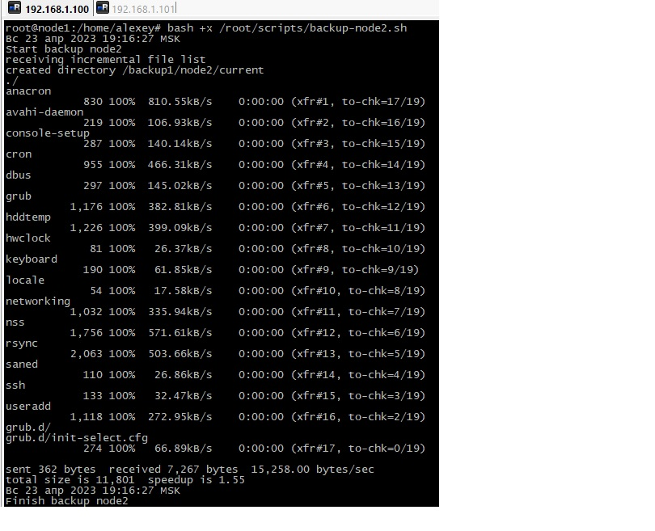

# Домашнее задание к занятию "`10.3 «Pacemaker»" - `Дьяконов Алексей`

##### Задание 1. Отличия  полного, дифференциального и инкреметного резервного копирования.

 - 1. `Полное резервное копирование - копирование всех данных, самое долгое, но самое надежное и быстрое при восстановлении`

 - 2. `Дифференциальное резервное копирование - сначала делается полный бэкап, а затем резервируются только те данные, которые изменились относительно него. Быстрее полного, но медленне при восстановлении `

 - 3. `Инкрементное резервное копирование - резервируются только те данные, которые изменились с момента последнего резервного копирования. Самое быстрое по выполнению, но медленное по восстановлению`

##### Задание 2. Установка bacula.

- 1. `Устанавливаем пакеты (при использовании Postgresql) `
    sudo apt install bacula postgresql

- 2. `Создаем папку для бэкапа`

    mkdir /backup
    sudo chown -R bacula:bacula /backup

- 3. `Правим конфигурационный файл службы bacula sd (отвечает за хранилище)`
    nano /etc/bacula/bacula-sd.conf

`Меняем /nonexistant/path/to/file/archive/dir на путь до созданной директории. SDAddress = 127.0.0.1 меняем на адрес хранилища.` 

- 4. `Проверяем на ошибки`
    sudo bacula-sd -t -c /etc/bacula/bacula-sd.conf

- 5. `Правим(если нужно) конфигурационный файл службы bacula fd (локальный клиент) `
    nano /etc/bacula/bacula-fd.conf

- 6. `Проверяем на ошибки`
    sudo bacula-fd -t -c /etc/bacula/bacula-fd.conf

- 7. `Правим(если нужно) конфигурационный файл службы bacula director (основной менеджер - в нем прописываем все задачи) `
    nano /etc/bacula/bacula-fd.conf`

- 8. `Проверяем на ошибки`
    bacula-dir -t -c ./bacula-dir.conf

- 9. `Правим(ес) конфигурационный файл  bacula console `
    nano /etc/bacula/bconsole.conf

- 10. `Перезапускаем службы`
    systemctl restart bacula-fd
    systemctl restart bacula-sd
    systemctl restart bacula-dir

- 11. ` Работаем в консоли`
    bconsole
    run
    `Выбираем нужную задачу`
    messages #для просмотра сообщений
    status #для просмотра статусов

 -  [bacula-sd.conf](./config/bacula-sd.conf) 
 -  [bacula-fd.conf](./config/bacula-fd.conf)
 -  [bacula-dir.conf](./config/bacula-dir.conf)

##### Задание 3. Установка rsync.

- 1. `Ставим пакеты(на всех)`
    apt install rsync

- 2. `Правим файл /etc/default/rsync(на всех)`
    nano /etc/default/rsync

    RSYNC_ENABLE = true

- 3. `Создаем файл(на источнике)`
    nano /etc/rsyncd.conf
    
    pid file = /var/run/rsyncd.pid
    log file = /var/log/rsyncd.log
    transfer logging = true
    munge symlinks = yes

    # папка источник для бэкапа
    [data]
    path = /etc/default
    uid = root
    read only = yes
    list = yes
    comment = Data backup Dir
    auth users = backup
    secrets file = /etc/rsyncd.scrt

- 4. `Создаём файл с учетными данными(на всех) `
    nano /etc/rsyncd.scrt
    backup:12345 # для сервера с котрого запускаем скрипт  - только пароль
    chmod 0600 /etc/rsyncd.scrt

- 5. `Создаём скрипт `
    mkdir /root/scripts/
    nano /root/scripts/backup-node2.sh

    #!/bin/bash
    date
    # Папка, куда будем складывать архивы — ее либо сразу создать либо не создавать а положить в уже существующие
    syst_dir=/backup/
    # Имя сервера, который архивируем
    srv_name=node2 #из тестовой конфигурации
    # Адрес сервера, который архивируем
    srv_ip=192.168.1.101
    # Пользователь rsync на сервере, который архивируем
    srv_user=backup
    # Ресурс на сервере для бэкапа
    srv_dir=data
    echo "Start backup ${srv_name}"
    # Создаем папку для инкрементных бэкапов
    mkdir -p ${syst_dir}${srv_name}/increment/ 
    /usr/bin/rsync -avz --progress --delete  --password-file=/etc/rsyncd.scrt ${srv_user}@${srv_ip}::${srv_dir} ${syst_dir}${srv_name}/current/ --backup --backup-dir=${syst_dir}${srv_name}/increment/`date +%Y-%m-%d`/
    /usr/bin/find ${syst_dir}${srv_name}/increment/ -maxdepth 1 -type d -mtime +30 -exec rm -rf {} \;
    date
    echo "Finish backup ${srv_name}"

    chmod 0744 /root/scripts/backup-node2.sh

- 6. `Тестируем`
    /root/scripts/backup-node2.sh

- 7. `Добавляем в cron`
    nano /etc/crontab

    30 23 * * * root /root/script/backup-node1.sh

    systemctl restart cron 

-
